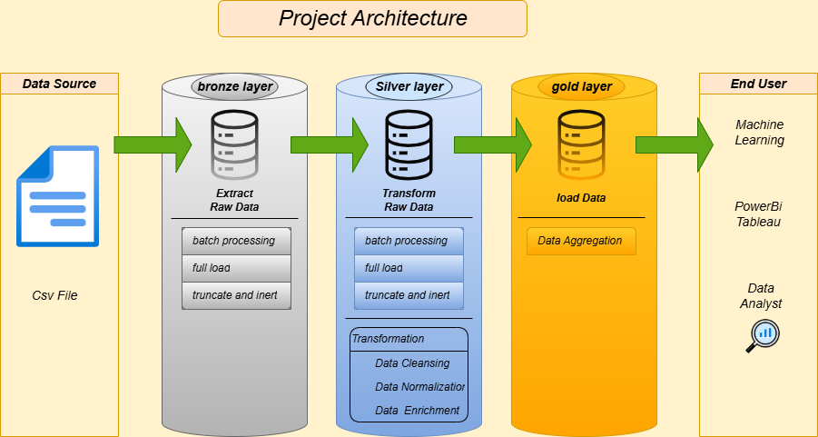

# SQL_DE_Project

## *Auto Insurance Data Engeneer and Analytics Project*

### *Welcome to the Auto Insurance Data Engeneer and Analytics Project repository! 🚀*

*This project apply Simple Data Engeneer and analytics solution, Using SQL to generate actionable insights. Designed as a portfolio project, it highlights industry best practices in data engineering and analytics.*

----------

*Data Architecture :*

*A. Bronze Layer: Stores raw data as-is from the source systems. Data is ingested from CSV Files into SQL Server Database.*

*B. Silver Layer: This layer includes data cleansing, standardization, and normalization processes to prepare data for analysis.*

*C. Gold Layer: Auto Insurance data Ready for reporting and analytics.*

----------

*Project Diagram :*

----------------------------------------

## *Feedback*

*If you have any feedback, please reach out to us at omars.soub@gmail.com*

## 🔗 Links

[*my github page-https://github.com/omars1234*](https://github.com/omars1234)

## *🛠 Skills*
*python, R, SQL ,PowerBi ,Tableaue*

